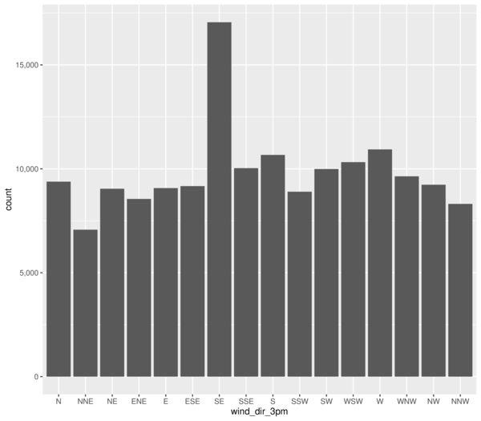
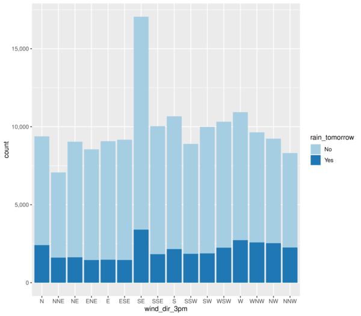
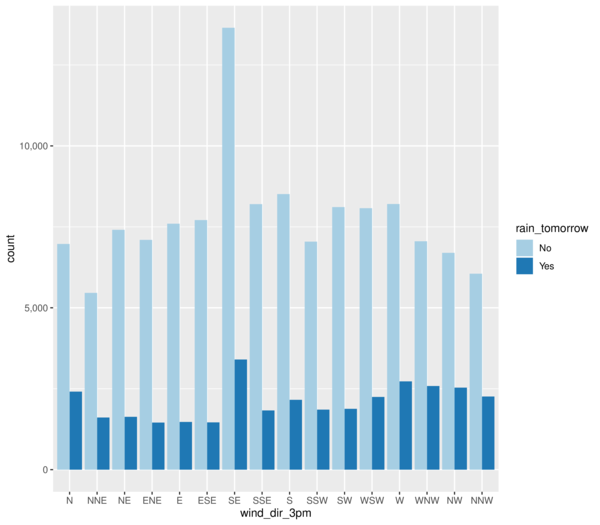
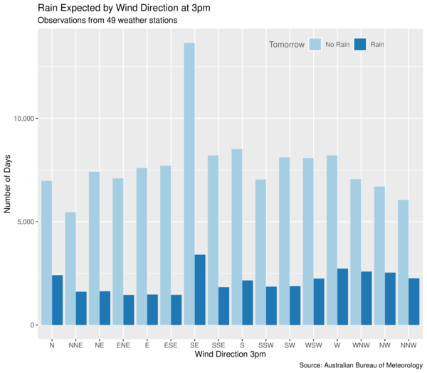

# Visualise Data Through Barcharts

Barcharts are a simple yet effective approach to understanding the
narrative the data can tell us.  This [MLHub](https://mlhub.ai)
package provides a simple demonstration illustrating the concept of
bar charts. This is useful for the new data scientist learning the
power of visualising data.

The examples here come from the [Essentials of Data
Science](https://bit.ly/essentials_data_science) by Graham Williams.
Further support material is also available from
[Togaware](https://essentials.togaware.com).

Visit the github repository for more details:
https://github.com/gjwgit/barchart

## Quick Start Command Line Examples

```console
$ ml demo barchart
```

## Usage

- To install mlhub (Ubuntu)

```console
$ pip3 install mlhub
```

- To install and configure the pre-built model:

```console
$ ml install   barchart
$ ml configure barchart
```

## Demonstration

```console
$ ml demo barchart
=====================================
Introducing Bar Charts with R ggplot2
=====================================

The Australian weather dataset from the Rattle package
(https://rattle.togaware.com) is used to illustrate bar
charts. The ggplot2 package provides the platform for
all of our plotting needs.

The examples we will use here come from the book,
Essentials of Data Science, by Graham Williams.
Visit https://essentials.togaware.com for more details.

Press Enter to continue: 

================
Simple Bar Chart
================

A simple bar chart is easy to generate using gpglot2 and can be used to
understand the frequency of observations. Below we explore the frequency of
different wind directions in the weather dataset.

The pipeline passes the dataset on to ggplot() where the aesethetics are
identified, simply associating the wind direction at 3pm with the x-axis.
A bar chart geometry is added to the plot. The heights of the bars will be
automatically determined from the dataset.

  ds %>%
    ggplot(aes(x=wind_dir_3pm)) +
    geom_bar()

Press Enter to continue: 

Close the graphic window using Ctrl-w.

Press Enter to continue: 
```

```console
============
Stacked Bars
============

We can plot a stacked bar chart to include an extra dimension (variable) in the
presentation. Here we have stacked the variable rain_tomorrow which records
whether there was rain reported on the following day.

  ds %>%
    ggplot(aes(x=wind_dir_3pm, fill=rain_tomorrow)) +
    geom_bar()

Press Enter to continue: 

Close the graphic window using Ctrl-w.

Press Enter to continue: 
```

```console

===========
Dodged Bars
===========

Often it is more effective to compare bars from a common baseline. The above
bars can be plotted side-by-side by introducing the use of the position=
argument when adding the bars to the plot. 

Press Enter to continue: 

Close the graphic window using Ctrl-w.

Press Enter to continue: 
```

```console

======================
Crafting the Bar Chart
======================

We demonstrate here a more fully and carefully crafted bar chart as we would
for our final presnetation of the data. Titles are added and the legend is placed
inside the plot iself.

Press Enter to continue: 

Close the graphic window using Ctrl-w.
```

```console
